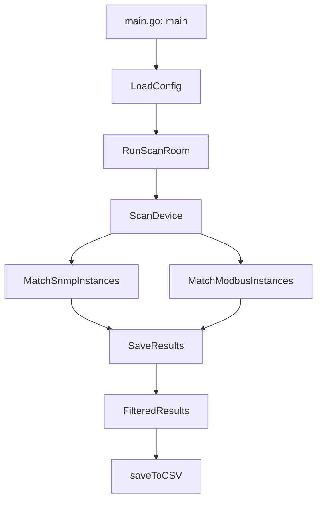
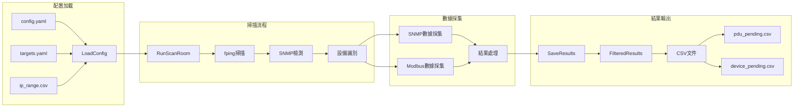
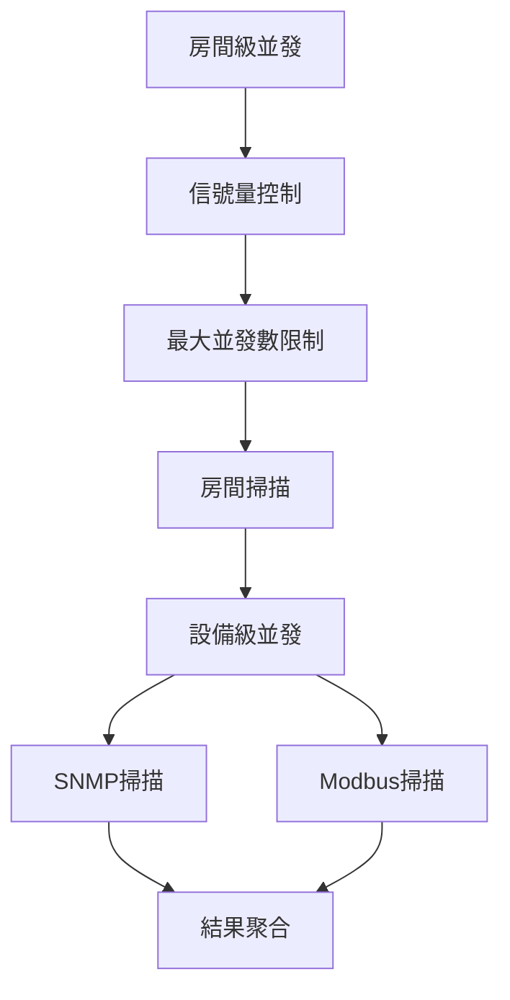
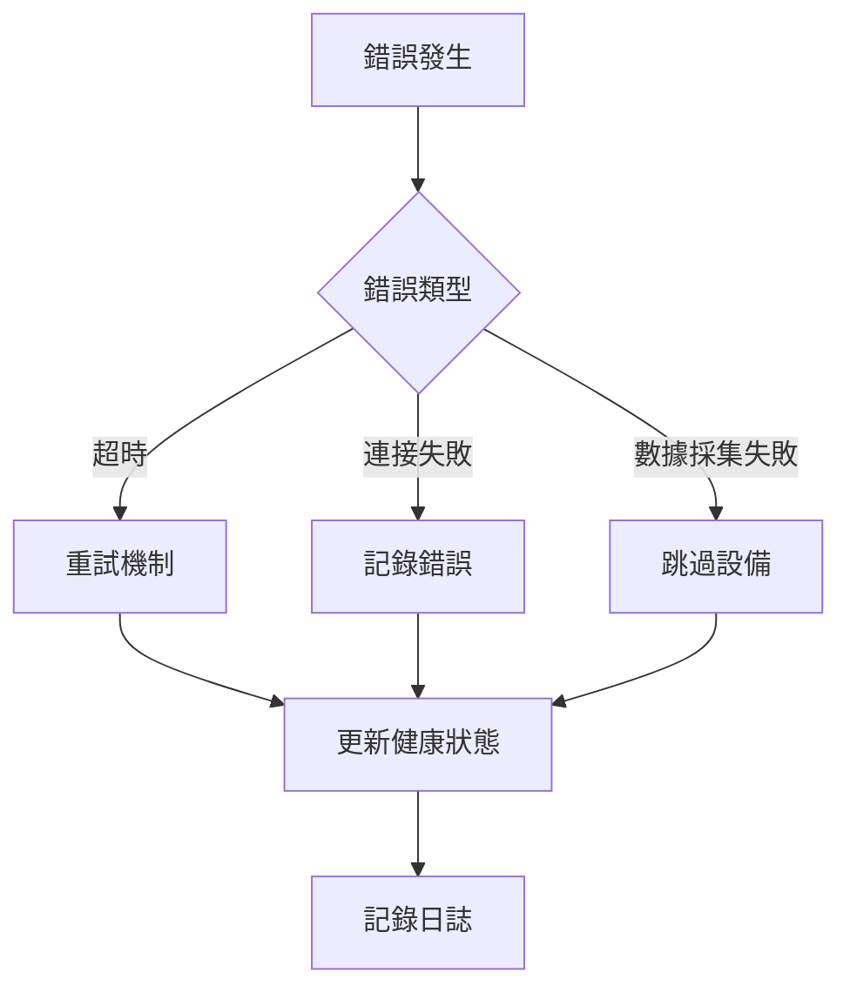

# 設備掃描工具

這是一個用於掃描和檢測網絡設備的工具。它支持 SNMP 協議，可以自動發現和識別各種設備。

## 功能特點

- 支持按房間分組進行並發掃描
- 支持 SNMP 協議檢測
- 自動識別設備型號
- 支持設備依賴關係
- 結果保存為 CSV 格式

## 專案架構

```
viot-scanner/
├── cmd/
│   └── main.go                 # 主程序入口
├── config/
│   ├── config.go              # 配置結構定義
│   └── config.yaml            # 主配置文件
├── global/
│   └── global.go              # 全局變量和函數
├── models/
│   ├── constants.go           # 常量定義
│   ├── device.go              # 設備模型定義
│   └── scan.go                # 掃描相關模型
├── services/
│   ├── collect.go             # 數據採集服務
│   ├── fping.go               # fping 掃描服務
│   └── scan.go                # 掃描服務
├── utils/
│   ├── modbus.go              # Modbus 工具
│   └── snmp.go                # SNMP 工具
├── go.mod                     # Go 模組定義
└── README.md                  # 項目文檔
```

### 核心模組說明

1. **cmd/main.go**
   - 程序入口點
   - 初始化配置
   - 啟動掃描服務

2. **config/**
   - 配置管理
   - 配置文件解析
   - 配置驗證

3. **global/**
   - 全局變量管理
   - 共享資源控制
   - 全局函數

4. **models/**
   - 數據模型定義
   - 常量定義
   - 類型定義

5. **services/**
   - 核心業務邏輯
   - 數據採集服務
   - 掃描服務

6. **utils/**
   - 工具函數
   - 協議實現
   - 輔助功能

### 函式觸發流程



### 資料流向



### 並發控制



### 錯誤處理流程



## 配置文件

### config.yaml

主要配置文件，包含以下設置：

```yaml
scanner:
  scan_interval: 300s # 掃描間隔
  ip_range_file: ip_range.csv # IP 範圍文件
  target_file: target.csv # 目標設備文件
  max_concurrent: 10 # 最大並發數
  fping_timeout: 1000 # fping 超時時間（毫秒）
  fping_retries: 3 # fping 重試次數
  modbus:
    port: [7000, 7001]
    mode: RTUOverTCP
    timeout: 5s
    retry: 3
    slave_id: [0, 1]
  snmp:
    port: [161] # SNMP 端口
    community: public # SNMP 團體字串
    version: 2c # SNMP 版本
    timeout: 5s # 掃描超時時間
    retry: 3 # 重試次數
    target_devices: # 目標設備列表
      - IOT_CLIENT-LIENEO-WCM-421
      - PDU-DELTA-PDU1315
      - PDU-DELTA-PDU4445
      - PDU-DELTA-PDUE428
      - PDU-VERTIV-6PS56
  device_dependencies: # 設備依賴關係
    - source: IOT_CLIENT-LIENEO-WCM-421
      targets:
        - PDU-DELTA-PDU1315
        - PDU-DELTA-PDU4445
        - PDU-DELTA-PDUE428
        - PDU-VERTIV-6PS56
```

### ip_range.csv

IP 範圍配置文件，格式如下：

```csv
factory,phase,datacenter,room,range,start,end
F12,P7,DC1,R0,172.5.0.0,172.5.0.1,172.5.7.254
F12,P7,DC1,R1,172.5.8.0,172.5.8.1,172.5.15.254
F12,P7,DC1,R2,172.5.16.0,172.5.16.1,172.5.23.254
F12,P7,DC1,R3,172.5.24.0,172.5.24.1,172.5.31.254
F12,P7,DC1,R4,172.5.32.0,172.5.32.1,172.5.39.254
F12,P7,DC1,R5,172.5.40.0,172.5.40.1,172.5.47.254
F12,P7,DC1,R6,172.5.48.0,172.5.48.1,172.5.55.254
F12,P7,DC1,R7,172.5.56.0,172.5.56.1,172.5.63.254
F12,P7,DC2,R0,172.6.0.0,172.6.0.1,172.6.7.254
F12,P7,DC2,R1,172.6.8.0,172.6.8.1,172.6.15.254
F12,P7,DC2,R2,172.6.16.0,172.6.16.1,172.6.23.254
F12,P7,DC2,R3,172.6.24.0,172.6.24.1,172.6.31.254
F12,P7,DC2,R4,172.6.32.0,172.6.32.1,172.6.39.254
```

## 掃描與設備發現流程

1. **IP 範圍掃描**
   - 從 `ip_range.csv` 讀取 IP 範圍配置
   - 按 room 分組進行並發掃描：
     - 每個 room 的 IP 範圍獨立使用 fping 掃描
     - 最大並發數由 `scanner.max_concurrent` 控制
     - 掃描結果按 room 分別收集
   - 對有回應的 IP 進行 SNMP 端口檢測

2. **設備識別與數據採集**
   - 根據 `targets.yaml` 中的設備定義進行匹配
   - 執行數據採集：
     - SNMP
     - Modbus
   - 錯誤處理機制：
     - 連接超時：重試 3 次
     - 數據採集失敗：記錄錯誤並繼續下一個設備
     - 設備匹配失敗：記錄到未識別設備列表

3. **設備註冊流程**
   - 根據設備類型記錄到對應的待處理列表：
     - PDU：記錄到 `scan_pdu.csv`
     - 其他 AP/Switch/IOT Client 設備：記錄到 `scan_device.csv`
   - 記錄完整的設備元數據，包括：
     - 從 targets.yaml 取得：`protocol` `instance_type` `manufacturer`
     - 從 ip 網段取得：`factory` `phase` `datacenter` `room`
     - `ip_key`：`$ip:$port` 或 `$ip:$port:$slave_id`
     - 採集到的所有元數據
     - 採集時間戳：`updated_at`

4. **設備類型定義**
   - PDU (Power Distribution Unit)
     - 支援廠商：DELTA, VERTIV
     - 支援型號：
       - DELTA: PDU1315, PDU4425, PDUE428
       - VERTIV: 6PS56
   - 網路設備
     - 支援類型：Switch, AP
     - 支援廠商：HPE, MOXA
     - 支援型號：
       - HPE: 5130, 5945
       - MOXA: AWK-1161A
   - IoT 設備
     - 支援廠商：LIENEO
     - 支援型號：WCM-421

5. **錯誤處理與日誌**
   - 錯誤等級：
     - ERROR：嚴重錯誤，需要立即處理
     - WARN：警告，需要關注
     - INFO：一般資訊
     - DEBUG：調試資訊
   - 日誌記錄：
     - 掃描開始/結束時間
     - 設備發現數量
     - 錯誤統計
     - 性能指標

## 使用方法

1. 安裝依賴：
```bash
go mod download
```

2. 編譯程序：
```bash
go build
```

3. 運行程序：
```bash
./modbus-master
```

## 注意事項

1. 確保有足夠的權限執行 fping 命令
2. 確保目標設備支持 SNMP 協議
3. 根據實際網絡環境調整超時和重試參數
4. 注意並發數設置，避免對網絡造成過大壓力

## TODO
1. 可以考慮添加單元測試來確保功能的正確性
2. 可以添加更詳細的日誌記錄，特別是性能指標
3. 可以考慮添加配置文件驗證功能
4. 可以考慮添加健康檢查機制

